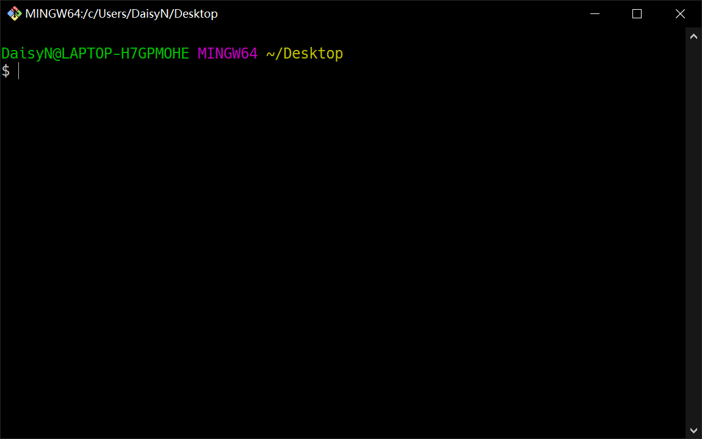

# 第一章 Git简介
## 一、版本控制
### 什么是版本控制系统？
大家平常有没有遇到这种情况：
我们的初始代码能跑通，但是随着我们加新的功能时，加着加着发现代码出现了问题。有些同学可能会疯狂ctrl+z进行回退，这种方法太过麻烦。于是，我们想有没有一种系统，可以帮助我们记录我们对代码的变化，并且可以恢复到指定的某个版本的代码。

这种系统其实就是版本控制系统，有了它我们就可以将选定的文件回溯到之前的状态，甚至将整个项目都回退到过去某个时间点的状态，我们可以比较文件的变化细节，查出最后是谁修改了哪个地方，从而找出导致怪异问题出现的原因，又是谁在何时报告了某个功能缺陷等等。使用版本控制系统通常还意味着，就算我们乱来一气把整个项目中的文件改的改删的删，我们也照样可以轻松恢复到原先的样子。但额外增加的工作量却微乎其微。


### 集中式版本控制vs分布式版本控制系统
现有的版本控制系统主要有两种形式：集中式和分布式。

集中式版本控制系统：集中式版本库集中存放于一个单一的中央服务器的，保存所有文件的修订版本。在协同工作时，人们需要先从中央服务器取得最新的版本，然后开始干活，干完活了，再把自己的活推送给中央服务器。因此，集中式版本控制系统需要在联网的情况下才能工作。

集中式版本控制有一个很致命的缺点就是中央服务器的单点故障。 如果宕机一小时，那么在这一小时内，谁都无法提交更新，也就无法协同工作。 如果中心数据库所在的磁盘发生损坏，又没有做恰当备份，毫无疑问你将丢失所有数据——包括项目的整个变更历史，只剩下人们在各自机器上保留的单独快照。

分布式版本控制系统：
分布式版本控制系统根本没有“中央服务器”，
我们每次是把代码仓库完整地镜像下来，包括完整的历史记录。这使得每个人的电脑上都是一个完整的版本库。这么一来，任何一处协同工作用的服务器发生故障，事后都可以用任何一个镜像出来的本地仓库恢复。同时，我们也不需要像联网就可以进行工作。每个人电脑上都有一个完整的版本库，那多个人如何协作呢？比方说你在自己电脑上改了文件A，你的同事也在他的电脑上改了文件A，这时，你们俩之间只需把各自的修改推送给对方，就可以互相看到对方的修改了。

但是在实际使用分布式版本控制系统的时候，其实很少在两人之间的电脑上推送版本库的修改，因为可能我们不在一个局域网内，两台电脑互相访问不了。因此，分布式版本控制系统通常也有一台充当“中央服务器”的电脑或者服务器，但这个服务器的作用仅仅是用来方便“交换”大家的修改，没有它大家也一样干活，只是交换修改不方便而已。这也是我们在GitHub建立repo的原因。


## 二、Git简介和历史

说到Git的诞生，我们就不得不提一下Linux之父 Linus Torvalds和Linux。Linux 内核开源项目有着为数众多的参与者。 绝大多数的 Linux 内核维护工作都花在了提交补丁和保存归档的繁琐事务上（1991－2002年间）。到2002年，整个项目组开始启用一个专有的分布式版本控制系统BitKeeper来管理和维护代码。

但是到了2005年，开发BitKeeper的商业公司认为Linux开发者内部有人对BitKeeper内部使用的协议进行逆向工程，因此他们收回了 Linux 内核社区免费使用 BitKeeper 的权力。 这就迫使 Linux 开源社区（特别是 Linux 的缔造者 Linus Torvalds）基于使用 BitKeeper 时的经验教训，开发出自己的版本系统。 他们对新的系统制订了若干目标：

- 速度

- 简单的设计

- 对非线性开发模式的强力支持（允许成千上万个并行开发的分支）

- 完全分布式

- 有能力高效管理类似 Linux 内核一样的超大规模项目（速度和数据量）

于是在Linux之父Linus Torvalds的带领下用了10天编写出了第一个Git版本。自诞生以来，Git 日臻成熟完善，在高度易用的同时，仍然保留着初期设定的目标。 它的速度飞快，极其适合管理大项目，有着令人难以置信的非线性分支管理系统（参见 Git 分支）。
## 三、Git的安装
关于Git的安装，我们可以访问Git book所给的下载教程进行下载，我们在下面的几部分也是仅做简要叙述。具体链接 --> [安装 Git](https://git-scm.com/book/zh/v2/%E8%B5%B7%E6%AD%A5-%E5%AE%89%E8%A3%85-Git)
### Linux
我们可以在terminal输入`git`命令查看系统有没有安装git。如果没有安装的话，我们可以访问git关于linux和unix的安装页面，输入对应的安装命令。网页链接 --> [Download for Linux and Unix](https://git-scm.com/download/linux)
对于常见的Debian和Ubuntu Linux，我们可以通过
```bash
sudo apt-get install git
```
就可以直接完成Git的安装。
### Windows
在 Windows 上安装 Git 也有几种安装方法。 我们也可以打开 https://git-scm.com/downloads  进行下载安装。安装好后我们可以打开Git bash。

另一个简单的方法是安装 GitHub Desktop。 该安装程序包含图形化和命令行版本的 Git。 它也能支持 Powershell，提供了稳定的凭证缓存和健全的换行设置。
### macOS
在 Mac 上安装 Git 有多种方式。 最简单的方法是安装 Xcode Command Line Tools。 Mavericks （10.9） 或更高版本的系统中，在 Terminal 里尝试首次运行 git 命令即可。
```bash
git --version
```
如果没有我们安装过命令行开发者工具，terminal也会提示你安装。

如果我们想安装更新的版本，可以使用二进制安装程序。 官方维护的 macOS Git 安装程序可以在 Git 官方网站下载，网址为 https://git-scm.com/download/mac。
## 初次运行Git的配置
当我们安装好Git后，还需要在Git bash或者terminal进行一些相关设置，以下设置仅需设置一次即可。
```bash
git config --global user.name "Your Name"
git config --global user.email "email@example.com"
```
除此之外，Git还有很多设置，包括常用编辑器等，大家可以键入以下命令查看自己的设置并进行修改。
```bash
git config --list
```
## 四、相关学习资源
在这里给大家推荐几个学习Git的资源，希望可以帮助大家在未来对Git有着更深的了解。

- [Git Book](https://git-scm.com/book/zh/v2)
- [廖雪峰Git教程](https://www.liaoxuefeng.com/wiki/896043488029600)
- [Git权威指南](https://gotgit.readthedocs.io/en/latest/index.html)
- [freenode](https://freenode.net/)
- [Github-cheat-sheet](https://github.com/tiimgreen/github-cheat-sheet)
- [动手学Git](https://www.freeaihub.com/git/index.html)
- [learn git branching](https://learngitbranching.js.org/?locale=zh_CN)