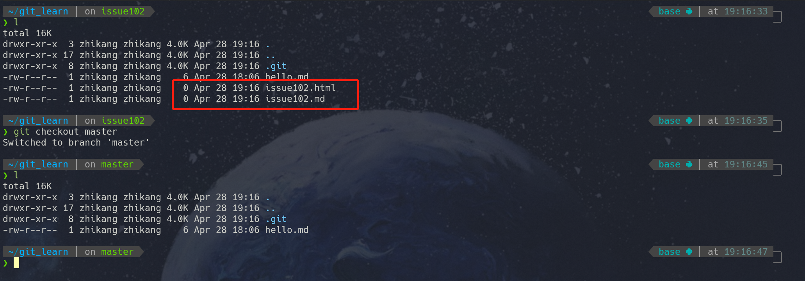
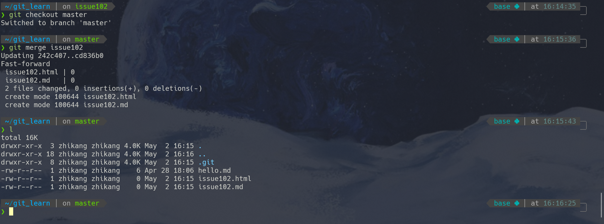
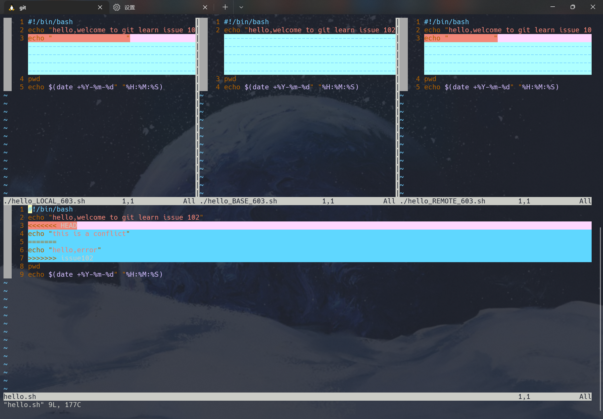

# 第三章 Git分支管理
## 一、分支的简介
Git最重要的运用场景是多人协同开发，但是如何能保证每个人之间的开发不影响其他人的开发进程，Git 分支的出现就是解决了这个问题，使得每个人之间的开发是独立的，互不影响的。

有的人将 Git 的分支模型称为它的“必杀技特性”，也正因为这一特性，使得 Git 从众多版本控制系统中脱颖而出。 为何 Git 的分支模型如此出众呢？ 因为Git 处理分支的方式可谓是难以置信的轻量，创建新分支这一操作几乎能在瞬间完成，并且在不同分支之间的切换操作也是一样便捷。 与许多其它版本控制系统不同，Git 鼓励在工作流程中频繁地使用分支与合并，哪怕一天之内进行许多次。 理解和精通这一特性，你便会意识到 Git 是如此的强大而又独特，并且从此真正改变你的开发方式。

## 二、分支的相关操作
### 分支的创建
Git分支的创建十分简单，我们可以使用`git branch`来查看现有的分支或创建新的分支。当不带任何命令参数时，输入`git branch`可以帮助我们查看当前项目所拥有的全部分支。并且Git会使用*来标明我们当前所处的分支上。
```bash
git branch
```
```bash
* master
```
当我们想要新增加新的分支时，只需要在`git branch`命令后面加上我们想要新建的分支的名称即可。
```bash
# 创建issue102的分支
git branch issue102
# 查看现有的所有分支
git branch
```
```bash
# 现有的分支
issue102
*master
```
我们可以发现虽然创建了`issue102`的分支，但是当前分支还是在master上。我们可以通过`git checkout`命令来进行切换分支。
### 分支的切换
在上面的例子中我们发现虽然创建了新的分支，但是当前分支还是在`master`分支上，我们需要通过`git checkout`命令切换到新建的`issue102`分支上，来进行后续的开发操作。
```bash
git checkout issue102
```
```bash
Switched to branch 'issue102'
```
这是我们可以在查看下当前分支的状态，我们可以发现当前分支已经转换到了`issue102`分支上。
```bash
git branch
* issue102
master
```
切换分支后，我们就可以进行自己的开发。分支上的文件状态是不同的。我们可以通过下面的例子有着更深入的了解。
```bash
# 切换分支
git checkout issue102

# 在分支上创建下新的文件
touch issue102.md
git add issue102.md
git commit -m "update issue102.md"

touch issue102.html
git add issue102.html
git commit -m "update issue102.html"
```
在完成上述命令后，我们可以通过`git log --oneline`检查下当前Git的记录。
```bash
cd836b0 (HEAD -> issue102) update issue102.html
7575f02 update issue102.md
242c407 (master) update hello.md
```
我们可以发现issue102分支上的记录与master的记录间隔开了。除此之外，当我们切换回主分支后，我们还会发现master分支下没有新建的issue102.md和issue102.html两个文件。正如下图所示：

### 分支的合并
当我们在分支上完成来开发工作后，我们需要将我们在当前分支进行的工作合并到主分支上。首先我们需要切回需要合并到的分支上，此处以`issue102`合并到`master`上为例子进行演示。
```bash
# 切换回主分支
git checkout master
# 使用git merge 进行合并
git merge issue102
# git branch --no-merged
# 查看所有未合并工作的分支
```

我们可以发现原来在`issue102`分支上的文件已经合并到了主分支上了，并且`issue102`分支还存在。大家可以根据实际的需求进行分支的保留与删除。


有时候分支的合并不会一番顺利，当我们在两个分支中对同一个文件的同一个部分进行了不同的修改，Git就没有办法顺利的合并他们，会在合并的时候产生合并冲突。比如我们在`issue102`分支和`master`分支下对`issue102.md`文件进行了修改，当我们将issue102分支融合到主分支上时就会发生冲突。如下图所示：


我们也可以通过`git status`查看命令来查看那些因包含合并冲突而处于未合并（unmerged）状态的文件。当出现矛盾后，合并的文件内容将会出现"<<<<<<","=======",">>>>>>"等分割线来进行标记。如下图所示：


当出现了矛盾时，我们需要进行手动解决或者放弃合并。
- 手动合并

    手动合并的方法很简单，就是我们选择我们要保留的代码，然后再把>>>>>, ======, <<<<<<这些提示行给去掉。最后重新进行add commit的操作即可。
- 放弃合并
    
    当我们发现冲突所导致的改动量很大时，我们可以选择放弃该次的合并。我们可以使用`git merge --abort`放弃此次的融合。如果我们在运行了git merge之后又进行了一些人为的改动，那么在abort之后，所进行的改动也会被回滚掉。

- mergetool

    除了手动合并以及放弃合并之外，我们还有一些其他的合并工具。git官方开发了一个专门用来合并的工具，叫做git mergetool(下图所示)，它会将找到一份两个分支的祖先代码作为base（基准），然后再将两个分支的改动都列举出来作为对比，让我们在git编辑器当中决定要留下什么。在此处，我们不做过多的阐述，感兴趣的同学可以点击下方链接进行查看。

    1. [Use vimdiff as git mergetool](https://www.rosipov.com/blog/use-vimdiff-as-git-mergetool/)
    2. [使用vimdiff作为git mergetool](https://kinboyw.github.io/2018/10/09/Use-Vimdiff-As-Git-Mergetool/)
    3. [git-mergetool](https://www.lhsz.xyz/read/git-doc-zh/docs-16.md)



### 分支推送到远程
在很多情况下，我们都需要将分支推送到远程，在这一部分，我们将讲一些远程的相关操作。
首先，我们可以使用`git remote -v`查看远程库的详细信息。会显示我们可以抓取或推送的origin地址。
```bash
$ git remote -v
origin  git@github.com:ProjectOwner/ProjectName.git (fetch)
origin  git@github.com:ProjectOwner/ProjectName.git (push)
```
当我们需要推送本地分支到远程时，需要指定具体的本地分支。
```bash
# 推送本地的master分支到远程
git push origin master
# 推送本地的issue102分支到远程
git push origin issue102
```
但是当我们多人协作进行开发的时候，可能会出现远程分支比我们本地更新的情况，这时，我们就需要使用`git pull`的命令来试图合并。如果合并出现冲突时，我们需要解决冲突再提交。在这部分，推荐大家可以看下廖雪峰老师的Git教程中的
[多人协作](https://www.liaoxuefeng.com/wiki/896043488029600/900375748016320)，如有侵权，请联系告知。
### 分支的删除
在Git中没有什么分支是不可以删除的（除了当前所在的分支不能删除），包括`master`分支也是可以进行删除。
Git的分支删除可以分为删除本地分支和远程分支。
- 删除本地分支
```bash
# branchName 是需要删除的本地分支名字
git branch -d branchName
```
当我们想强行删除分支时，只需要将参数d改为D即可。
- 删除远程分支
```bash
# origin 是远程的主机名
# branch 需要删除的远程分支
git push origin --delete branch
```
### 分支的重命名
当我们需要重命名分支的名称时，我们可以使用`git branch`命令来进行，具体方式如下：
```bash
# oldBranchName: 旧分支名
# newBranchName ：新分支名
git branch -m oldBranchName newBranchName
```
当我们想要将改名后的分支推送到远程时，我们需要进行如下操作：
```bash
git branch -m oldBranchName newBranchName   # 将本地的分支进行重命名
git push origin newBranchName               # 将新的分支推送到远程        
git push --delete origin oldBranchName      # 删除远程的旧的分支 
```
## 三、分支开发工作流
当我们已经了解了分支的操作后，我们应该考虑使用一种怎样的方式使我们最大化的使用分支操作的优点。在接下来的这部分中，我们将会介绍一些常见的分支开发工作流程。而正是由于分支管理的便捷，才衍生出这些典型的工作模式，我们以后可以根据项目实际情况进行使用。

### 长期分支
在整个项目开发周期的不同阶段，我们可以同时拥有多个分支；然后我们可以定期地把某些主题分支合并入其他分支中。许多使用 Git 的开发者都喜欢使用这种方式来工作，比如只在 master 分支上保留完全稳定的代码——有可能仅仅是已经发布或即将发布的代码。 他们还有一些名为 develop 或者 next 的平行分支，被用来做后续开发或者测试稳定性——这些分支不必保持绝对稳定，但是一旦达到稳定状态，它们就可以被合并入 master 分支了。这样，在确保这些已完成的主题分支（短期分支，比如之前的 issue102 分支）能够通过所有测试，并且不会引入更多 bug 之后，就可以合并入主干分支中，等待下一次的发布。


### 短期分支
短期分支也可以叫做主题分支，它的作用是用来实现某一种特性或者相关工作（修复bug，开发产品新特性）。比如当我们的产品出现了bug时，我们应该新建一个分支并起名为bug分支，并在该分支上进行bug的修复，等我们的代码确定不会引起其他bug时，我们就可以合并到主分支上进行修复。当我们看见issue时，我们也可以使用同样的方式来解决issue的问题。常见的短期分支还有上面提到的develop，topic分支。在实际开发中，我们应该按照以下几个基本原则进行分支开发工作流程

1. master分支应该是最稳定的，也就是仅用来发布新版本，平时不能直接在上面进行操作，应该保存在远程。
2. 短期分支是我们干活的分支，短期分支可以不用上传到远程，当我们完成了bug的修复，新功能的开发时才需要合并到主分支上。
3. 多使用分支来进行开发工作。

