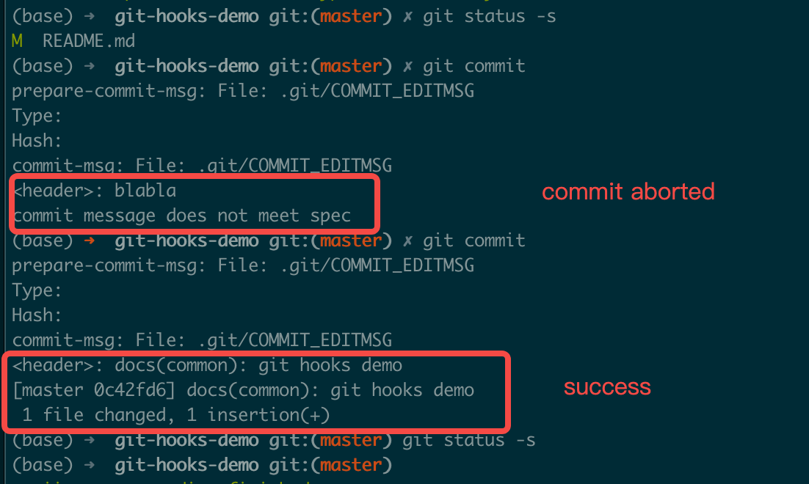

# 第七章 Git提交规范
## 前言

Git是目前程序员必备基础技能，可以用来管理代码、文档、博客，甚至菜谱。个人的私有仓库的提交相对而言可以
较为随意，但是在团队开发中，还是要遵循相应的规范。本文对Git使用中涉及到提交相关的实践做了些整理，
供大家参考。


如上图所示（截取自Angular commit [970a3b5](https://github.com/angular/angular/commit/970a3b5c70fee29aa40945836ebeb464d75438e4)），
一个commit包含如下几个信息：

* commit message - 提交的内容相关描述
* author & committer - 作者及提交者
* changed files - 修改的文件
* hash & parent - 提交内容的hash及在提交树上的位置

## Commit Message

提交消息描述的是当前提交的功能相关信息，一般可以包括`header`，`body`，`footer`，

```
<header>
<BLANK LINE>
<body>
<BLANK LINE>
<footer>
```

业内做的好的可以参考Angular的提交标准：[Commit Message Format](https://github.com/angular/angular/blob/master/CONTRIBUTING.md#commit)

其中`header`是必须的。Angular官方建议的格式如下

```
<type>(<scope>): <short summary>
  │       │             │
  │       │             └─⫸ Summary in present tense. Not capitalized. No period at the end.
  │       │
  │       └─⫸ Commit Scope: animations|bazel|benchpress|common|compiler|compiler-cli|core...
  │
  └─⫸ Commit Type: build|ci|docs|feat|fix|perf|refactor|test
```

`<header>`中，`<type>`与`<summary>`是必须的，`<scope>`可以选填。建议`<header>`需要保持在50个字符之内。

`<type>`表明本次提交的类型，一般有如下几种：

* `build`: 涉及构建相关的改动
* `ci`: 持续集成相关的改动
* `docs`: 文档
* `feat`: 新功能
* `fix`: bug修复
* `perf`: 性能相关改动
* `refactor`: 重构相关（非bug、非新功能）
* `test`: 测试相关，包括新增测试或者更改已有测试

`<scope>`表示改动影响的范围。在Angular中，某个提交可能涉及的范围有表单处理、动画处理等。
在实际工作中可以视项目而定。

`<summary>`则是对本次提交的简要描述，使用祈使句、现在时。如使用`change`而不是`changed`或
`changes`。

`<body>`是提交信息的更为详细的描述，与`<header>`一样也是用祈使句、现在时。`<body>`描述本次
修改的动机，比如为什么引入本次改动，之前的逻辑是什么，现在的逻辑是什么，本次改动有哪些影响，等等。

最后，`<footer>`是可选项，一般涉及破坏性改动、功能的弃用等说明，以及对`GitHub issue`或
`Jira ticket`的引用，PR的引用等。

规范的提交信息可以使用工具对内容进行解析，自动化生成文档或者发布日志。在一些大型的开源项目中，
版本的更新文档，接口的更新及兼容性影响，纯粹靠人工整理是很费时费力的，用统一的规范能够极大自动化
这部分工作。当然不同的项目对提交信息的要求和格式标准也不一样，开源项目或者公司项目对提交信息的
要求也有差异，一般需要遵从所在项目的约定。较为成熟的开源项目一般可以在`README`文档中找到如何贡献，
或者有单独的`CONTRIBUTING.md`文档，对代码风格、提交方式等进行约定。

### 自动化校验`commit message`

有了提交信息的规范，如何确保开发者对规范进行遵守呢？我们可以使用Git提供的`Git Hooks`功能对提交
的信息进行校验。本文不对`Git Hooks`的细节做过多介绍，仅做基础的说明，具体细节可以参考
[官方文档](https://git-scm.com/book/en/v2/Customizing-Git-Git-Hooks)
或[Atlassian的文档](https://www.atlassian.com/git/tutorials/git-hooks)。

在新初始化的git项目内，我们可以在`.git/hooks`文件夹中找到官方提供的样例：

```shell
ls -l .git/hooks
total 120
-rwxr-xr-x  1 tomo  staff   478B Nov 11 20:44 applypatch-msg.sample
-rwxr-xr-x  1 tomo  staff   896B Nov 11 20:44 commit-msg.sample
-rwxr-xr-x  1 tomo  staff   4.5K Nov 11 20:44 fsmonitor-watchman.sample
-rwxr-xr-x  1 tomo  staff   189B Nov 11 20:44 post-update.sample
-rwxr-xr-x  1 tomo  staff   424B Nov 11 20:44 pre-applypatch.sample
-rwxr-xr-x  1 tomo  staff   1.6K Nov 11 20:44 pre-commit.sample
-rwxr-xr-x  1 tomo  staff   416B Nov 11 20:44 pre-merge-commit.sample
-rwxr-xr-x  1 tomo  staff   1.3K Nov 11 20:44 pre-push.sample
-rwxr-xr-x  1 tomo  staff   4.8K Nov 11 20:44 pre-rebase.sample
-rwxr-xr-x  1 tomo  staff   544B Nov 11 20:44 pre-receive.sample
-rwxr-xr-x  1 tomo  staff   1.5K Nov 11 20:44 prepare-commit-msg.sample
-rwxr-xr-x  1 tomo  staff   2.7K Nov 11 20:44 push-to-checkout.sample
-rwxr-xr-x  1 tomo  staff   3.6K Nov 11 20:44 update.sample
```

涉及提交相关的是下面四个：

* `pre-commit` - 在Git生成`commit`对象前执行
* `prepare-commit-msg` - 在`pre-commit`后执行，用以生成默认的提交信息，脚本接收三个参数：
  1. 包含提交信息的临时文件名
  1. 提交的类型，如`message`, `template`, `merge`, `squash`
  1. 相关提交的SHA1，仅在有`-c`, `-C`或`--amend`参数时提供该参数
* `commit-msg` - 在开发者编写提交信息后执行，仅有临时文件名一个参数
* `post-commit` - 在`commit-msg`后立马执行，更多做通知用

我们可以用`prepare-commit-msg`对提交信息规范做说明，并用`commit-msg`对规范的执行
进行检查，脚本的非0的返回会中断本次提交。

如我们想应用简单的类似Angular的`<header>`的格式，可以参考如下的实现。

下面是`prepare-commit-msg`的示例：

```python
#!/usr/bin/env python

import sys, os, re
from subprocess import check_output

# Collect the parameters
commit_msg_filepath = sys.argv[1]
if len(sys.argv) > 2:
    commit_type = sys.argv[2]
else:
    commit_type = ''
if len(sys.argv) > 3:
    commit_hash = sys.argv[3]
else:
    commit_hash = ''

print("prepare-commit-msg: File: %s\nType: %s\nHash: %s" % (commit_msg_filepath, commit_type, commit_hash))

msg_spec = '''# Please use follow format
# <type>(<scope>): <short summary>
#  │       │             │
#  │       │             └─⫸ Summary in present tense. Not capitalized. No period at the end.
#  │       │
#  │       └─⫸ Commit Scope: animations|bazel|benchpress|common|compiler|compiler-cli|core
#  │
#  └─⫸ Commit Type: build|ci|docs|feat|fix|perf|refactor|test'''

with open(commit_msg_filepath, 'r+') as f:
    f.write("\n" + msg_spec)

sys.exit(0)  # return non-zero will abort current commit
```

下面是简单的`commit-msg`示例：

```python
#!/usr/bin/env python

import sys, os, re
# Collect the parameters
commit_msg_filepath = sys.argv[1]
print("commit-msg: File: %s" % commit_msg_filepath)

header_pattern = re.compile(r'^(?P<type>\w+)(\((?P<scope>\w+)\))?: .+$')
commit_types = 'build|ci|docs|feat|fix|perf|refactor|test'.split('|')
commit_scopes = 'animations|bazel|benchpress|common|compiler|compiler-cli|core'.split('|')

with open(commit_msg_filepath, 'r') as f:
    commit_msg_header = f.readline().rstrip('\n')  # header line
    print('<header>: %s' % commit_msg_header)
    match = header_pattern.match(commit_msg_header)
    if not match:
        print('commit message does not meet spec')
        sys.exit(1)
    commit_type = match.group('type')
    commit_scope = match.group('scope')
    if commit_type not in commit_types:
        print('invalid <type>')
        sys.exit(1)
    if commit_scope and commit_scope not in commit_scopes:  # scope is optional
        print('invalid <scope>')
        sys.exit(1)

sys.exit(0)
```

想使用相关的`Git Hooks`，可以在目录`.git/hooks`创建对应的文件，文件名为`prepare-commit-msg`
及`commit-msg`，并赋予可执行权限。这样在我们进行`git commit`操作时，对应的脚本就会执行。
下图是相关执行示意图，其中不合规范的提交会被中断。



具体执行过程可以参考[在线执行过程](https://asciinema.org/a/dEQHRiP9r6vjaSoSUlD9Sn1nn)

Git的提交不会包含`.git`目录，所以对应的`hooks`的改动并不会被提交到仓库中。我们可以在仓库根目录
创建`.githooks`文件夹并将我们实现的代码放到该目录中，通过更改配置或者软连接的方式进行引用：

```shell
# use config
git config core.hooksPath .githooks
# OR use soft link
ln -sf .githooks/* .git/hooks
```

当然这些都是客户端的校验，开发者可以完全忽视这样的一些`Git Hooks`的配置并引入不合规范的提交，
这种情况下我们可以使用服务端校验进行处理，或者引入一些CI工具或使用GitHub Action进行校验。

## Author & Committer

Git中，Author表示原始纂写该提交的作者，Committer表示应用该提交的人，如合并`Pull Request`
的项目管理员。如果是个人开发者或只使用单个Git平台服务（如GitHub、BitBucket等），我们一般
不需要对作者进行特别的配置。但如果使用多个Git平台或者有公司内部要求，我们可能需要针对不同的仓库
设置不同的用户及邮箱，比如全局可以设置个人的GitHub账号，企业内部仓库设置企业邮箱等。

```shell
# 全局默认配置
git config --global user.email "<github email>"
git config --global user.name "<github username>"
# 企业内部仓库
git config user.email "<enterprise email>"
git config user.name "<real name>"
```

## Changed files

我们所有的提交，核心的其实我们提交的文件。不同的提交涉及的文件可多可少，一般遵循以下一些原则：

* 提交前使用`git diff`查看文件的改动，使用`git add`添加期望进入提交的文件，
使用`git status`查看文件状态，最终使用`git commit`进行提交
* 单次提交仅提交相关的改动，例如修复两个不同的bug应该使用两次独立的提交
* 鼓励经常性的提交，这样可以更快的分享实现的功能，并且减少代码丢失的风险
* 在主分支或者协作的功能分支不能提交半成品，提交之前需要进过测试
* 编译输出，日志，中间产物等，不要引入到提交中，使用`.gitignore`进行相关文件的排除，不同语言
或者操作系统有一些通用的排除配置，参考[github/gitignore](https://github.com/github/gitignore)
* 密码、授权凭证、密钥等，**不要提交**。如AWS的certificate.csv文件或内容，
GCP的Service Account文件等，泄露到公开仓库会导致资源被不法分子使用，造成损失。同时由于Git的特性，
想从历史提交中移除这类文件会较为困难，参考[GitHub官方相关文档及描述](https://docs.github.com/en/authentication/keeping-your-account-and-data-secure/removing-sensitive-data-from-a-repository)
* 对于配置文件（如数据库连接信息等），一般使用配置模板，个人维护本地文件，且该文件在`.gitignore`
中配置。或者使用`git update-index --[no-]assume-unchanged <file>`来忽略某些文件的改动
* 其他一些常用命令（请在明确知道其含义后使用）
  + `git reset <file>` - 移除被添加的文件（提交之前），`reset`命令的其他可以查看帮助文档
  + `git clean -f` - 移除较多的未被追踪的中间文件
  + `git checkout <file>` - 回退对某个文件的改动（提交之前）

## Hash & Parent

一般情况，`commit hash`及父节点信息我们不需要额外关注，但在特定场景下我们可能需要对`commit`
进行修复或者其他处理。在这样的场景下，我们需要理解整个git的提交链，每个提交对应的父节点，分支
间的共同祖先，以及本地与远端的差异，尤其涉及`rebase`相关的操作时。同时我们需要在整个提交中
遵循项目使用的工作流模型，使用对应工作流模型中建议的操作（常见的工作流模型参考
[Atlassian文档](https://www.atlassian.com/git/tutorials/comparing-workflows)）。

下面是一些实际开发过程中涉及的场景：

* 在自身的开发分支，某个功能涉及多个提交，在正式合并至主分支前对相关的提交进行整理，可以使用
`git rebase -i <commit>`命令，对提交进行合并、废弃、修改提交信息等处理。需要注意的是如果提交
已经发布到远端，需要使用`git push -f`进行覆盖（仅限个人开发分支）。下面是一个简单的例子及相关
命令描述，常见的命令有`pick`, `reword`, `fixup`, `drop`等。

```
$ git rebase -i 8717c71fc
reword 27e67629b feat: some feature first commit
fixup 7a3f0cd25 feat: some feature second commit
fixup d9a9d7f04 feat: some feature third commit

# Rebase 8717c71fc..d9a9d7f04 onto 8717c71fc (3 commands)
#
# Commands:
# p, pick <commit> = use commit
# r, reword <commit> = use commit, but edit the commit message
# e, edit <commit> = use commit, but stop for amending
# s, squash <commit> = use commit, but meld into previous commit
# f, fixup [-C | -c] <commit> = like "squash" but keep only the previous
#                    commit's log message, unless -C is used, in which case
#                    keep only this commit's message; -c is same as -C but
#                    opens the editor
# x, exec <command> = run command (the rest of the line) using shell
# b, break = stop here (continue rebase later with 'git rebase --continue')
# d, drop <commit> = remove commit
# l, label <label> = label current HEAD with a name
# t, reset <label> = reset HEAD to a label
# m, merge [-C <commit> | -c <commit>] <label> [# <oneline>]
# .       create a merge commit using the original merge commit's
# .       message (or the oneline, if no original merge commit was
# .       specified); use -c <commit> to reword the commit message
#
# These lines can be re-ordered; they are executed from top to bottom.
#
# If you remove a line here THAT COMMIT WILL BE LOST.
#
# However, if you remove everything, the rebase will be aborted.
```

* 在一些Git工作流模型中，使用`git pull --rebase`对本地提交进行更新
* 原则上禁止对主分支等进行`git push -f`操作，涉及需要回退的，使用`git revert <commit>`
* 涉及多分枝代码同步，可以使用`git cherry-pick`命令

