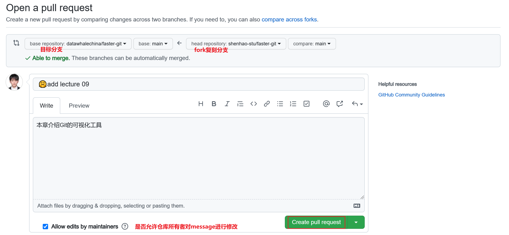

# 第九章 Git 图形工具

> 作者：shenhao

## 9.0 前言：为什么要使用 Git GUI ？

Git 虽然作为一个开源的分布式版本控制系统，可以有效、高速地处理从很小到非常大的项目版本管理，但在实际项目研发过程中，开发人员通常只会使用几个常见的命令进行协同工作。从之前的章节，我们已经深入了解到了 Git 的基本原理和众多命令，有些命令由于不常使用，较难记忆。因此，对于多数项目开发者而言，在终端上运行的纯文本命令并不是最佳的选择；有时候可视化图形界面更符合用户的习惯。Git GUI 为用户提供了一个可视化的图形界面，允许项目开发者通过简单的点击便捷地使用Git，从而不需要在终端上手动输入繁多的文本命令。这样一来，开发者能够更高效、更便捷地进行项目版本管理。

本章将介绍以下三种主流的 Git GUI 图形化工具，帮助开发者能更为轻松、高效的利用 Git 进行项目版本管理。

- **GitHub Desktop**
- **TortoiseGit**
- **Vscode Git**

在本教程中，只介绍了部分Git GUI 图形客户端， 更多详细内容可以查看✅[ Git 官网](https://git-scm.com/downloads/guis/)。

## 9.1 GitHub Desktop

[GitHub Desktop](https://desktop.github.com/) 可能是所有 Git 可视化应用中最著名的方案。几乎所有开发人员都熟悉 GitHub ，而 Github Desktop 正是 Github 推出的开源 Git GUI 图形客户端。可以在Windows和Macos平台上进行使用，目前暂不支持Linux平台。

### 9.1.1 基本使用

首先进入官网，根据不同的系统，下载并安装对应版本的 [GitHub Desktop](https://desktop.github.com/) 。

#### 9.1.1.1 登录

完成下载后，第一次打开软件会直接要求登录个人 Github 账户进行授权，并配置用户名和邮箱（识别个人创建的commits提交）。

如果没有找到让你登录 GitHub 账号的地方，你需要在 File -> Options -> Accounts -> Sign in 登录。

在完成基本配置后，会出现如下界面：

#### 9.1.1.2 建立首个仓库

初次登陆会看到三个选项，也就是建立自己的第一个repository。

建立一个repo可以通过三个方式：

- clone a repository：克隆一个repo

- create new repository：建立一个新的repo
- add a local repository：添加一个本地的repo

我们先选择从URL中克隆 [faster-git](https://github.com/datawhalechina/faster-git) 仓库，如下图，需要修改的地方为URL链接以及本地存储的路径。

#### 9.1.1.3 提交Pull Request

##### fork

由于在实际开源项目贡献的过程中，开发者往往并没有直接修改仓库内容的权限，因此需要先对目标仓库进行fork操作，再通过提交PR的方式进行代码的贡献。在下图中，可以通过左下角的warning标志⚠，判断用户是否有目标仓库的权限。如果没有写入权限，点击create a fork，将目标仓库复刻为自己的仓库，进行随意的修改。

在 Github Desktop 中完成fork后，登录 Github 网页就可以在个人仓库中看到目标仓库的复刻版，如下所示。

##### commit & push

在完成了fork后，当前仓库就会索引到用户个人的复刻仓库，对应于本地指定目录下的文件。此时，用户拥有复刻仓库的所有权限，包括修改，删除，更改可视状态等等。接下来，就可以对本地分支中的代码进行修改，更新而当操作，再push到用户个人的复刻仓库中。

此时，登录 Github 网页版就会发现本地修改的代码已经上传到云端，个人复刻仓库进行了本地同步。

##### PR

在完成个人仓库的代码更新后，还要注意个人仓库的分支和目标分支的先后情况，如果目标分支领先于fork分支，需要先通过fetch upstream操作进行更新后，再提交PR。

> **upstream**分支指向上游地址即目标分支，这里的**upstream**名字可以任意指定，只是一般都把上游地址都叫**upstream**。

点击Contribute，并Open pull request，向目标仓库提交上传申请。

在完成PR后，会自动跳转到目标仓库，可以看到在Pull requests一栏中，上标增加了1，1就是贡献者所提交PR。之后就需要目标仓库的拥有者对贡献的代码进行审阅，如果代码合规可利用，就会将fork分支的commits合并到主分支中。这样一来，就完成了一次贡献！！👏👏

## 9.2 TortoiseGit

TortoiseGit 简称 tgit， 中文名海龟 Git ，是一个开放的 Windows 系统下的 Git 版本控制系统的源客户端，提供有中文版支持。由于它不是针对特定IDE(如Visual Studio、Eclipse或其他)的集成，所以可以与任何开发工具和任何类型的文件一起使用。与 Github Desktop 一类的传统图形化交互不同，与 TortoiseGit 的交互主要利用 Windows 资源管理器的上下文菜单，因此不需要打开任何软件，十分轻量、便捷。

### 9.2.1 下载

根据操作系统的位数，下载并安装对应版本的 TortoiseGit 及中文语言包（✅ TortoiseGit 及语言包[下载](https://tortoisegit.org/download/) ，✅TortoiseGit [安装教程](https://jingyan.baidu.com/article/f3ad7d0f37a75d09c2345b6f.html)）。

### 9.2.2 安装

1、双击刚刚下载好的msi文件进入安装

2、连续两次next之后，到如下页面，更改下载位置，继续next

3、点击Install进行安装

4、点击Finish配置TortoiseGit

5、选择英文进入连续两次点击下一页

6、配置git.exe，并点击下一页

7、填写用户名和邮箱，并点击下一页

8、完成tortoisegit安装

9、双击TortoiseGit-LanguagePack-64bit-zh_CN.msi，配置中文语言

### 9.2.3 基本使用

与 Github Desktop 不同，TortoiseGit 是通过鼠标右键菜单栏的方式进行 git 命令的交互，桌面空白处右键后如下所示。

#### 9.2.3.1 建立首个仓库

本地Git仓库的创建有两种，一是直接Clone已存在的Git仓库，二是本地创建版本库。

##### Clone仓库

在存放项目的目录点右键，选择Clone，配置目标仓库的URL以及本地存储的路径。

克隆成功，在文件夹上就可以看到角标标识，下图是克隆后并修改的情况：

Git文件上角标符号是用于反映出当前文件或者文件夹的状态：

1、正常的：**绿色的对号**

2、被修改过的：**红色感叹号**

3、新添加的：**蓝色的加号**

4、未受控的（无版本控制的）：**蓝色的问号**

5、忽略不受控的：**灰色的减号**

6、删除的：**红色的叉号**

7、有冲突的：**黄色的感叹号**

> 若是看不到角标符号可以查看该教程：[TortoiseGit状态图标不能正常显示的解决办法](https://www.cnblogs.com/xiesong/p/5761352.html)

##### 创建本地版本库

新建一个项目目录myfaster-git，在代码目录右键选择创建版本库。在弹出提示中，不要勾选纯版本库，直接确定

之后项目目录下就会生成一个.git的目录，这个目录里面记录的是git操作相关内容。

#### 9.2.3.2 Add & Commit & Push

在完成项目的代码更新后，可以右键选择 Git 提交进行add、commit以及push操作。

填写日志信息作为commit的message，同时勾选设置作者日期以及作者，明确代码更新的细节。再在变更列表中选择需要commit的文件，最后点击提交并推送完成push操作。

#### 9.2.3.3 Pull

当需要更新本地代码时，可以右键选择TortoiseGit，再选择拉取进行fetch。

> 📃注意：其余的一些git操作，可以在下拉框中进行操作，见上图。

#### 9.2.3.4 配置远端

右键选择TortoiseGit，再选择设置，进入以下界面。在Git下的远端中，可以配置本地main分支所对应的远端分支，例如个人Github仓库的origin分支，或者fork分支的上游upstream分支等等。

## 9.3 Vscode Git

在实际项目开发过程中，往往遇到的场景是项目开发者直接通过代码编辑器进行Git操作，在本章中，主要介绍Vscode中Git的一些基础的操作。

导入项目文件，选择侧边栏的第三项，就可以看到以下内容。

首选暂存所有更改，再在消息栏中输入message并点击勾进行提交，或者使用快捷键Ctrl+Enter进行提交。

完成add和commit操作后，点击同步，即可以push到远端。

## 9.4 本章小结

在本章的前言部分，通过比较在日常应用场景下终端命令和图形化界面的优劣，引出了 Git GUI 图形化应用。再详细介绍了三种类型的 Git GUI 图形化应用，Github Desktop、TotoiseGit以及Vscode Git。与传统的命令行不同，图形化界面为项目开发者提供了更为轻松、高效的方式利用 Git 进行项目版本管理。在下一章中，将详细介绍Git团队协作以及合并时的diff工具。

🎉冲冲冲！！！
